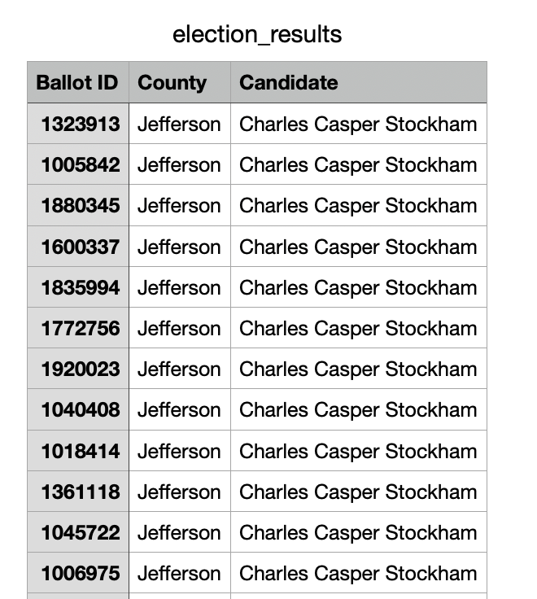
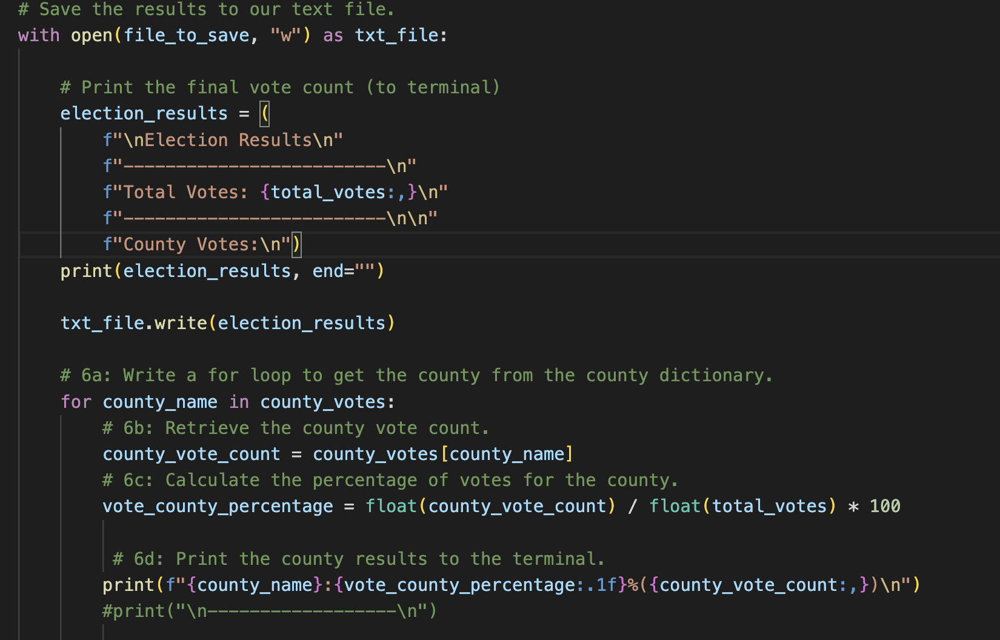
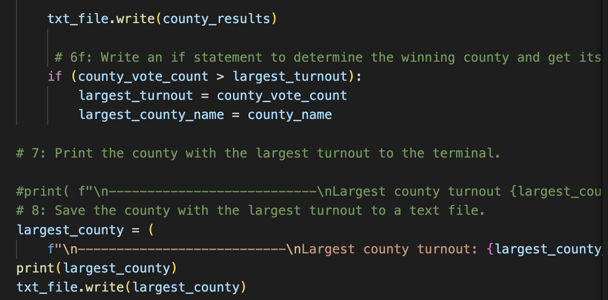
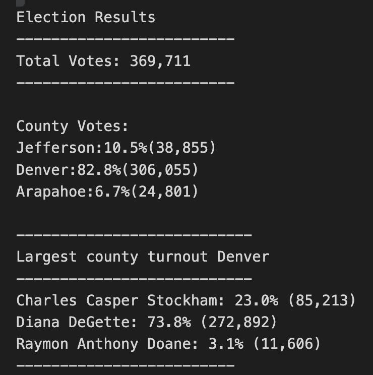

# Election Analysis
## Overview of Project
In this project we will be helping Colorado board of elections , in the election audit of the tabulated results of U.S congressional precinct. We will be reporting total number of votes cast, the total number of votes for each candidate, the percentage of votes for each candidate, the winner of the election based on the popular vote, which county has highest votes and number of votes in each county. We are provided with the data representing Balllot id , county and name of the candidate like this in csv file 

## Election Audit Results

1. Total number of votes cast in the congressional elections are 369,711
2. There are three county and number of votes for each county with their vote percentage are 

    #### County Votes 
    1 Jefferson : 38,855 votes (10.5%)

    2 Denver : 306,005 votes (82.8%)

    3 Arapahoe : 24,801 votes (6.7%)

    

3. By using this code we calculated which county has largest number of votes - DENVER
 

    

4. We then analyzed number of votes and the percentage of the total votes each candidate received.

    ### Number of votes by each candidate & Percentage 
    1. Charles Casper Stockham : 85,213 & 23.0% 

    2. Diana DeGette : 272,892 & 73.8%

    3. Raymon Anthony Doane : 11,606 & 3.1%

     

5. After exploring and calculating the highest vote count 
we conclude that Diana DeGette is winner 
-------------------------
    Winner: Diana DeGette
    Winning Vote Count: 272,892
    Winning Percentage: 73.8%
-------------------------
After reviewing the 369,711 total votes, Denver County had the highest voter turnout, and the winner of the election is Diana DeGette with 272,892 votes representing a supermajority of 73.8% of all votes. 

## Election_Audit_Summary

In this election we can also analyze county vise vote to each candidate , i.e how many votes were given to which candidate from the counties. By modifying the script and this can help U.S congressinal to understand where there is low turnout and they can increase the campaginig for larger turnout. 

If we have data for different years , we can modify the script by comparing the data for two years and can explore percentage difference on candidate and county. 
